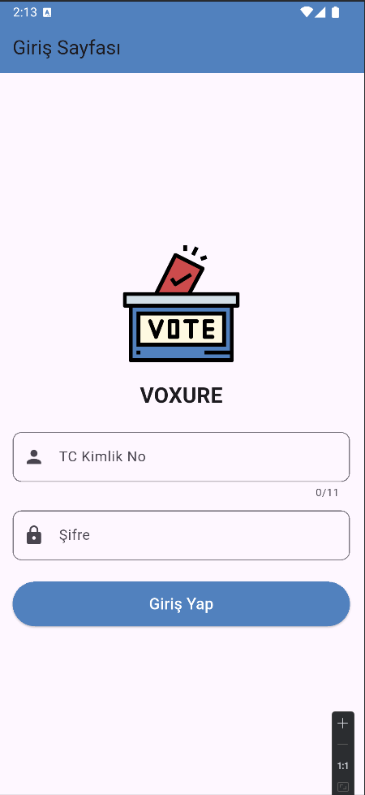
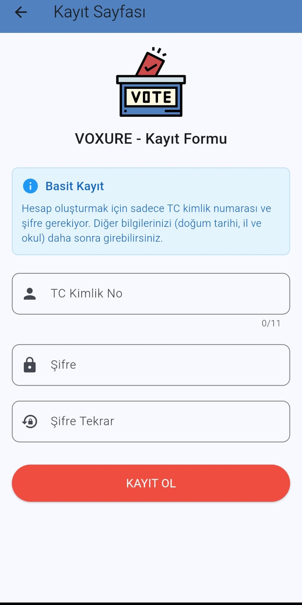
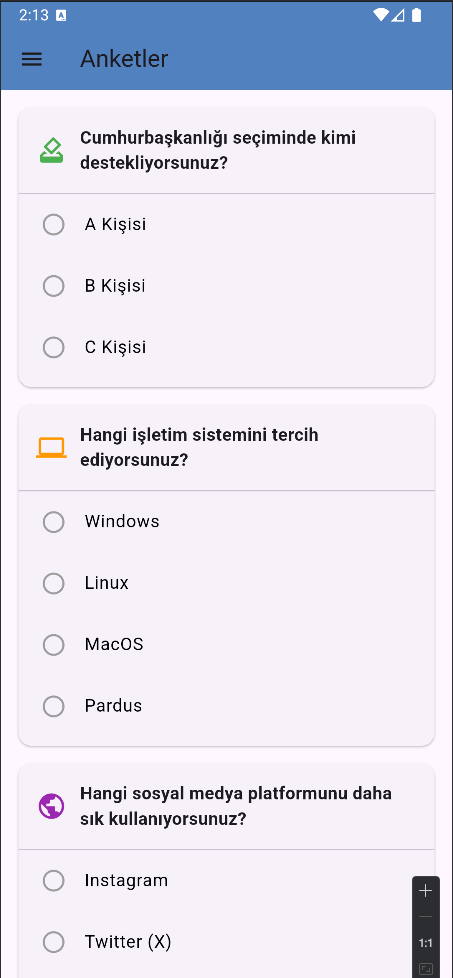
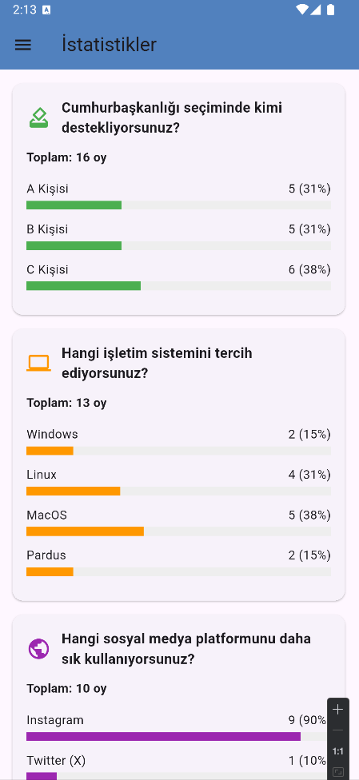
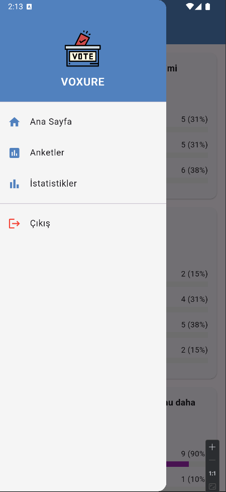

# Voxure - Blockchain Tabanlı Oylama Uygulaması

Voxure, Flutter ile geliştirilen mobil uygulama, Ethereum blockchain üzerindeki akıllı sözleşme (Solidity) entegrasyonu sayesinde güvenli ve şeffaf bir oylama deneyimi sunar. Web3dart ile mobil istemci ve blockchain arasında etkileşim sağlanırken, Ganache kullanılarak yerel test ağı üzerinde geliştirme ve testler yürütülmüştür.

## Projenin Amacı

Blockchain teknolojisi kullanarak güvenli, şeffaf ve manipülasyona karşı dirençli bir dijital oylama platformu oluşturmak hedeflenmiştir. Kullanıcılar ankete katılabilir, sonuçları gerçek zamanlı olarak takip edebilir ve blockchain'in sağladığı güvenlik ile oylarının değiştirilemez olduğundan emin olabilirler.

## Teknik Detaylar

- **Flutter**: Mobil uygulama geliştirme platformu  
- **Ethereum Blockchain**: Akıllı sözleşme ve oy saklama  
- **Solidity**: Akıllı sözleşme programlama dili  
- **Web3dart**: Flutter-Ethereum blockchain entegrasyonu  
- **Ganache**: Yerel Ethereum test ağı  
- **Firebase Authentication**: Kullanıcı kimlik doğrulama  
- **Firestore**: Gerçek zamanlı veri senkronizasyonu  

## Öne Çıkan Özellikler

- 🔐 Blockchain tabanlı güvenli oylama  
- 📊 Gerçek zamanlı sonuç takibi  
- 🎯 Admin panel ile anket yönetimi  
- 👤 Kullanıcı profili ve kimlik doğrulama  
- 📈 İstatistik görüntüleme ve analiz  
- 🌐 Ethereum blockchain entegrasyonu  
- 🔄 Gerçek zamanlı veri senkronizasyonu  
- 🎨 Modern ve kullanıcı dostu arayüz  

## Kullanılan Teknolojiler

- Flutter  
- Ethereum Blockchain  
- Solidity Smart Contracts  
- Web3dart  
- Ganache  
- Firebase Authentication & Firestore  
- HTTP  

## Sayfalar ve Görevleri

### 1. Giriş Sayfası (`login_page.dart`)
#### Örnek Ekran Görüntüsü

- Firebase Authentication ile kullanıcı girişi  
- E-posta/şifre doğrulama sistemi  
- Blockchain cüzdan bağlantısı  

### 2. Kayıt Sayfası (`register_page.dart`)

- Yeni kullanıcı hesabı oluşturma  
- Firebase'e kullanıcı bilgilerini kaydetme  
- Blockchain cüzdan oluşturma ve bağlama  

### 3. Ana Sayfa (`home_page.dart`)
- Mevcut anketlerin listesi  
- Kullanıcının katılabileceği aktif oylamalar  
- Hızlı erişim menüleri  

### 4. Anket Sayfası (`survey_page.dart`)

- Aktif anketlere katılım  
- Blockchain üzerinde oy kaydetme  
- Seçenekleri görüntüleme ve oy verme  

### 5. İstatistik Sayfası (`statistics_page.dart`)

- Gerçek zamanlı sonuç görüntüleme  
- Grafik ve istatistiksel analiz  
- Blockchain verilerinin doğrulanması  

### 6. Profil Güncelleme (`profile_update_page.dart`)
- Kullanıcı bilgilerini düzenleme  
- Firebase ve blockchain senkronizasyonu  
- Hesap ayarları ve güvenlik  

### 7. Drawer Menü

- Navigasyon menüsü  
- Kullanıcı profil bilgileri  
- Hızlı erişim linkleri  

## Blockchain Entegrasyonu

- **Ethereum Blockchain**: Oyların güvenli ve değiştirilemez saklanması  
- **Solidity Smart Contracts**: Oylama mantığı ve kuralları  
- **Web3dart**: Flutter uygulaması ile blockchain arasında köprü  
- **Ganache**: Geliştirme ve test ortamı  

## Firebase Entegrasyonu

- **Firebase Authentication**: Kullanıcı kimlik doğrulama ve oturum yönetimi  
- **Firestore**: Anket meta verileri ve kullanıcı profilleri  
- **Gerçek Zamanlı Senkronizasyon**: Anket sonuçlarının canlı güncellemeleri  

## Modüler Yapısı

- `services/auth_service.dart`: Firebase kimlik doğrulama  
- `services/blockchain_service.dart`: Ethereum blockchain işlemleri  
- `services/survey_service.dart`: Anket yönetimi ve veri işleme  
- `models/`: Veri modelleri (User, Survey, Vote)  
- `widgets/`: Ortak UI bileşenleri  
- `contracts/`: Solidity akıllı sözleşmeleri  

## Geliştirme Ortamı

- Flutter SDK  
- Firebase CLI  
- Ganache (Ethereum test ağı)  
- Remix IDE (Solidity geliştirme)  
- MetaMask (Cüzdan entegrasyonu)  
- Android Studio  
- Visual Studio Code  

## İletişim

Proje geliştiricileri: **Ahsen Çakır**, **Furkan Yılmaz**, **Yağmur Bilge Akköse**, **Metehan Beyaz**, **Yusuf Erdoğdu**, **Muhammed Zakir Demirel**

## Kurulum

1. Flutter SDK'yı yükleyin
2. Ganache'ı indirin ve çalıştırın
3. Firebase projesi oluşturun ve yapılandırın
4. Akıllı sözleşmeleri Ganache üzerinde deploy edin
5. Bağımlılıkları yükleyin:
```bash
flutter pub get
```
6. Uygulamayı çalıştırın:
```bash
flutter run
```

## Blockchain Kurulumu

1. Ganache'ı başlatın
2. MetaMask cüzdanınızı Ganache ağına bağlayın
3. Remix IDE'de Solidity sözleşmelerini compile edin
4. Sözleşmeleri Ganache'a deploy edin
5. Contract adreslerini uygulamada güncelleyin

## Güvenlik Özellikleri

- 🔒 Blockchain tabanlı oy güvenliği
- 🛡️ Değiştirilemez oy kayıtları
- 🔐 Kriptografik doğrulama
- 👤 Kimlik doğrulama zorunluluğu
- 📝 Şeffaf denetim izleri
